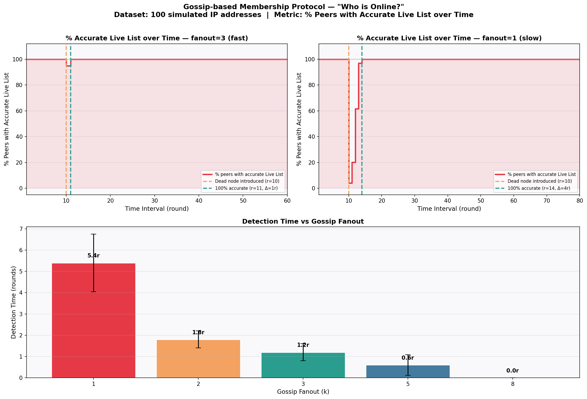

# Gossip-based Membership Protocol: “Who is Online?”
Nguyễn Thị Yến Nhi - N23DCCN112 - D23CQCN02-N

## Giới thiệu:
Dự án mô phỏng giao thức Gossip-based Membership Protocol trên mạng ngang hàng (P2P) gồm 100 node. Thay vì sử 
dụng registry trung tâm, mỗi node tự duy trì một Partial View (danh sách 10 node hàng xóm ngẫu nhiên) và định kỳ trao đổi trạng thái với nhau qua cơ chế push-pull gossip.

**Mục tiêu phân tích:** Khi một node bị tắt đột ngột, toàn bộ mạng cần bao nhiêu vòng gossip để phát hiện ra?

**Metric chính:** % peers with accurate Live List theo từng vòng gossip.

## Yêu cầu hệ thống
- Python 3.13.7
- Thư viện: matplotlib, numpy

## Cài đặt
```bash
# Bước 1: Clone repository
git clone https://github.com/ntynhi10/N23DCCN112_NguyenThiYenNhi_CSDLPT.git

# Bước 2: Cài đặt thư viện
pip install matplotlib numpy
```
## Cách chạy
```bash
python main.py
```

Sau khi chạy xong:
- Terminal hiển thị kết quả % accurate Live List theo từng round
- Hiển thị kết quả kiểm tra Partial View của 5 node ngẫu nhiên (mỗi node có đúng 10 hàng xóm ngẫu nhiên)
- File gossip_analysis.png được tạo ra trong thư mục hiện tại

## Cấu trúc dự án
| File | Mô tả |
|---|---|
| `node.py` | Định nghĩa Node: IP, live_list, dead_list, merge(), detect_failure() |
| `simulation.py` | Engine mô phỏng: khởi tạo mạng, gossip rounds, kill node, đo metric |
| `analysis.py` | Vẽ biểu đồ: % accurate Live List theo thời gian, Detection Time vs Fanout |
| `main.py` | Entry point — chạy toàn bộ simulation và xuất kết quả |

## Kết quả


## Tài liệu tham khảo:
[1] Özsu, M. T., & Valduriez, P. (2020). Principles of Distributed Database Systems (4th ed.). Springer. Chapter 9, pp. 395–448.